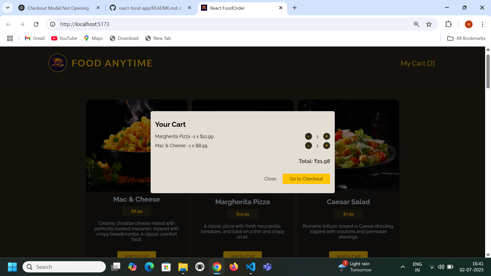

# 🍽️ React Food Order App

A complete frontend food ordering web application built using React. Users can browse meals, add them to the cart, and place an order with their details. This project demonstrates practical use of React fundamentals like Context API, hooks, modals, component-driven architecture, and form submission.

---

## 🚀 Live Demo

🌐 [Click here to view the live project]==>>https://react-food-app-drab.vercel.app/  


---

## 💡 Features

- Browse a list of meals fetched from an API
- Add or remove meals from the cart
- Real-time cart price calculation
- Checkout modal with form
- Submit order data via POST request
- Reusable components & clean UI

---

## 🛠️ Tech Stack

- **Frontend:** React, Vite, CSS Modules
- **State Management:** React Context API
- **HTTP:** Fetch API with custom `useHttp` hook
- **Deployment:** Vercel / Netlify (optional)
- **Tooling:** JavaScript (ES6), React Portals, HTML5 Dialog

---

## 📁 Project Structure

<details>
  <summary>👇 Click to Expand and Copy</summary>

  <pre>

📦 src/
 ┣ 📂components/
 ┃ ┣ 📜Meals.jsx
 ┃ ┣ 📜Cart.jsx
 ┃ ┣ 📜Checkout.jsx
 ┃ ┗ 📂UI/
 ┃   ┣ 📜Modal.jsx
 ┃   ┣ 📜Button.jsx
 ┃   ┗ 📜Input.jsx
 ┣ 📂store/
 ┃ ┣ 📜CartContext.jsx
 ┃ ┗ 📜UserProgressContext.jsx
 ┣ 📂hooks/
 ┃ ┗ 📜useHttp.js

  </pre>
</details>

---

## 📷 Screenshots

Home page - 

---


Cart Model - 


---

## 🧪 How to Run Locally

```bash
git clone https://github.com/01-coder07/react-food-app.git
cd react-food-app
npm install
npm run dev
```

Runs locally at: `http://localhost:5173`

---

## 🙋‍♂️ About Me

**Harshit Pant**  
🎓 B.Tech | Aspiring Full Stack Developer  
📧 [harshitpant2005@gmail.com](mailto:harshitpant2005@gmail.com)  
🔗 GitHub: [@01-coder07](https://github.com/01-coder07)  
🌟 Portfolio: _Coming soon_

---

## 📝 What I Learned

- Component-based architecture in React
- Using React Context for shared state
- Building custom reusable hooks (`useHttp`)
- Modal handling using portals and dialog
- Clean code structure and modular design

---

## 🌟 Feedback

If you found this project useful or have any suggestions, feel free to open an issue or connect with me. Thanks for visiting!

---

